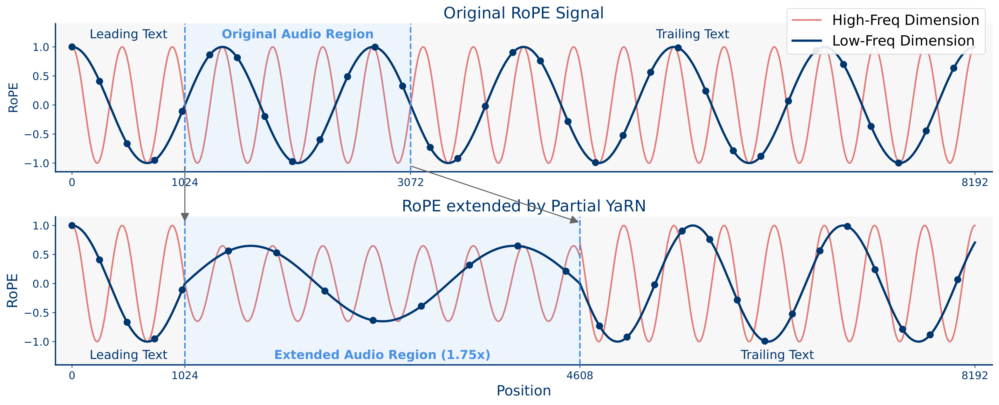

# Partial YaRN: Audio-Only Context Extension for Large Audio-Language Models

This repository contains the PyTorch code of **Partial YaRN** and **Virtual Longform Audio Training (VLAT)** from the paper: \
[Extending Audio Context for Long-Form Understanding in Large Audio-Language Models](https://arxiv.org/abs/2510.15231). 2025.

Our work focuses on extending the audio context window of Large Audio-Language Models (LALMs) without degrading the sophisticated language capabilities of the base Large Language Model (LLM). The core idea is to apply context extension methods, such as YaRN, in a targeted manner. Instead of altering the positional encodings of the entire input sequence, Partial YaRN modifies *only* the audio tokens. This preserves the original positional information for text tokens, thereby protecting the LLM's pretrained language understanding.

---



## 📌 Table of Contents
* [Repository Structure](#-repository-structure)
* [Installation](#-installation)
* [Usage](#-usage)
* [How It Works](#-how-it-works)
* [Citation](#-citation)

## 📂 Repository Structure <a name="-repository-structure"></a>

The repository is organized as follows:

```
.
├── assets
│   ├── audio.wav                   # Sample audio file
│   └── sample_data.json            # Sample data
├── models
│   ├── modeling_qwen2_audio.py     # Main LALM model definition
│   ├── modeling_qwen2.py           # Modified Qwen2 text backbone with Partial YaRN RoPE implementation
│   └── processing_qwen2_audio.py   # Model's processor
├── inference_qwen2_audio.py        # Script for general-purpose inference
└── inference_qwen2_audio_mcqa.py   # Script for MCQA evaluation
```

-   **`models/modeling_qwen2.py`**: This is the most critical file, containing our custom implementations of Rotary Position Embeddings (RoPE). The `Qwen2PartialYarnRotaryEmbedding` class implements the logic for applying positional interpolation exclusively to audio tokens.
-   **`inference_qwen2_audio_mcqa.py`**: This script runs a formal evaluation on a multiple-choice question-answering (MCQA) task. It parses the model's output to calculate an accuracy score.
-   **`inference_qwen2_audio.py`**: This script is for general-purpose inference. It takes the same inputs but prints the model's raw text response directly without any parsing or scoring.
-   **`assets/`**: This directory contains sample data needed to run the code.

## ⚙️ Installation <a name="-installation"></a>

To set up the environment and install the required dependencies, please follow these steps. We recommend using a Python virtual environment.

1.  **Clone the repository:**
    ```bash
    git clone https://github.com/scb-10x/partial-yarn.git
    cd partial-yarn
    ```

2.  **Create and activate a Python virtual environment:**
    ```bash
    python3 -m venv venv
    source venv/bin/activate
    # On Windows, use: venv\Scripts\activate
    ```

3.  **Install the dependencies from `requirements.txt`:**
    ```bash
    pip install -r requirements.txt
    ```

## ▶️ Usage <a name="-usage"></a>

We provide two scripts for interacting with the model: one for formal MCQA evaluation and another for general-purpose inference. Both scripts share the same set of command-line arguments for model configuration.

### Shared Command-Line Arguments

-   `--test-dataset-path` (required): Path to the JSON file containing the test dataset.
-   `--model-path`: The Hugging Face path or local directory of the model to be evaluated. Defaults to `Qwen/Qwen2-Audio-7B-Instruct`.
-   `--enable-partial-yarn`: **This is the key flag.** Add it to activate the Partial YaRN context extension method.
-   `--interpolation-start-dim`: Specifies the dimension index from which to start applying interpolation in Partial YaRN. A value greater than 0 enables Partial YaRN logic.
-   `--attention-temperature`: A scaling factor applied to the audio tokens when calculating attention score with Partial YaRN enabled.

### 1. MCQA Evaluation

Use `inference_qwen2_audio_mcqa.py` to evaluate the model's accuracy on an MCQA dataset.

**Command Structure:**
```bash
python inference_qwen2_audio_mcqa.py --test-dataset-path <path_to_your_data.json> [OPTIONS]
```

**Examples:**

*   **Running the baseline model:**
    ```bash
    python inference_qwen2_audio_mcqa.py \
        --test-dataset-path assets/sample_data.json \
        --model-path Qwen/Qwen2-Audio-7B-Instruct
    ```

*   **Running with Partial YaRN enabled:**
    ```bash
    python inference_qwen2_audio_mcqa.py \
        --test-dataset-path assets/sample_data.json \
        --model-path Qwen/Qwen2-Audio-7B-Instruct \
        --enable-partial-yarn \
        --interpolation-start-dim 32 \
        --attention-temperature 1.2
    ```

### 2. General-Purpose Inference

Use `inference_qwen2_audio.py` to see the model's direct text output for your questions.

**Command Structure:**
```bash
python inference_qwen2_audio.py --test-dataset-path <path_to_your_data.json> [OPTIONS]
```
**Examples:**

*   **Running the baseline model:**
    ```bash
    python inference_qwen2_audio.py \
        --test-dataset-path assets/sample_data.json \
        --model-path Qwen/Qwen2-Audio-7B-Instruct
    ```

*   **Running with Partial YaRN enabled:**
    ```bash
    python inference_qwen2_audio.py \
        --test-dataset-path assets/sample_data.json \
        --model-path Qwen/Qwen2-Audio-7B-Instruct \
        --enable-partial-yarn \
        --interpolation-start-dim 32
    ```

## 💡 How It Works <a name="-how-it-works"></a>

The core of our method is implemented in **`models/modeling_qwen2.py`**. We have modified the standard Rotary Position Embedding (RoPE) module of the Qwen2 architecture.

1.  **RoPE Module Swap**: The default `Qwen2RotaryEmbedding` is replaced with our custom `Qwen2PartialYarnRotaryEmbedding` class within the `Qwen2Model` definition.
2.  **Dynamic Position ID Calculation**: The `forward` method of our custom RoPE class receives an `audio_mask`. This mask identifies which tokens in the input sequence correspond to audio.
3.  **Targeted Interpolation**:
    -   If a token is identified as **text**, its original positional ID is used.
    -   If a token is identified as **audio**, we calculate a new, interpolated positional ID. This is done by scaling the positions of the audio segment from its actual token length down to the model's original trained audio length (e.g., mapping a 60s audio segment's tokens into the positional space of a 30s segment).
4.  **Inference Script Integration**: The inference scripts (`inference_qwen2_audio_mcqa.py` and `inference_qwen2_audio.py`) pass the necessary flags (`--enable-partial-yarn`, etc.) during model initialization, ensuring that our custom RoPE module is used and configured correctly.

This targeted approach allows the model to handle long audio inputs by "compressing" their positional information into the range it was trained on, all while ensuring the text processing capabilities remain unaffected.

## Citation <a name="-citation"></a>

If you find this repository helpful, please consider citing:
```
@misc{chaichana2025extendingaudiocontextlongform,
      title={Extending Audio Context for Long-Form Understanding in Large Audio-Language Models}, 
      author={Yuatyong Chaichana and Pittawat Taveekitworachai and Warit Sirichotedumrong and Potsawee Manakul and Kunat Pipatanakul},
      year={2025},
      eprint={2510.15231},
      archivePrefix={arXiv},
      primaryClass={cs.CL},
      url={https://arxiv.org/abs/2510.15231}, 
}
```
